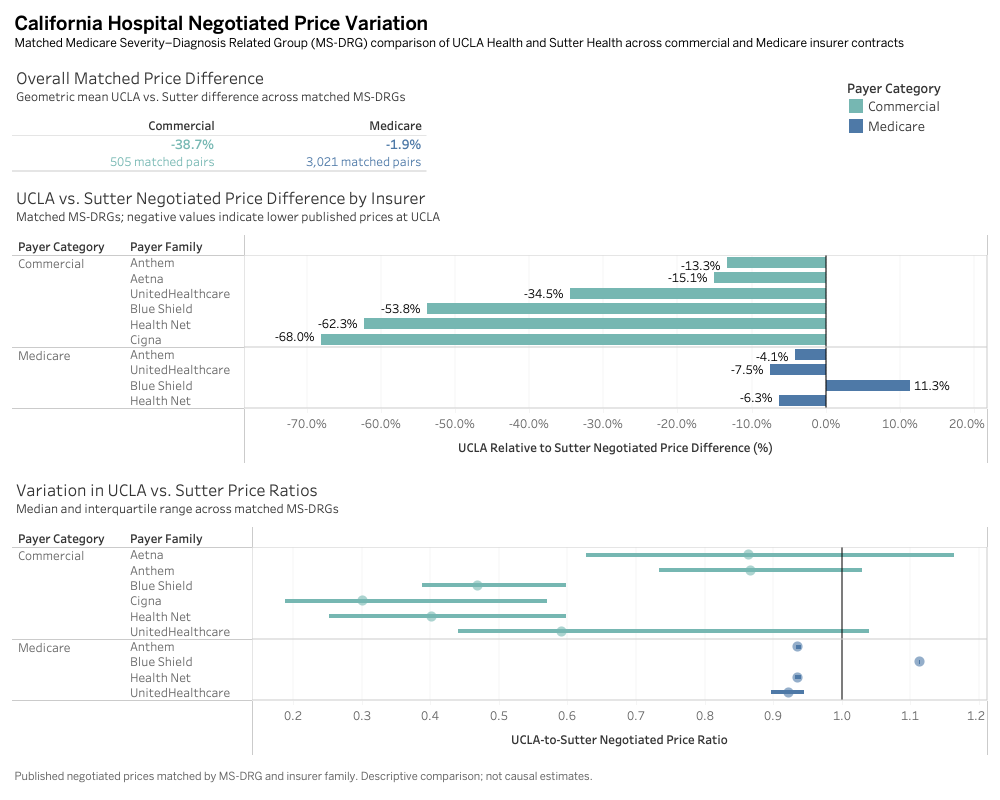

# California Hospital Negotiated Price Variation

An end-to-end data engineering and analytics project examining variation in published hospital negotiated prices across major California health systems.

The project ingests and standardizes hospital machine-readable files, integrates CMS, California HCAI, and Census ACS data, builds a BigQuery warehouse, analyzes matched inpatient prices, models price variation, and visualizes results in Tableau.

## Project Scale

- **5.77M negotiated-price records**
- **3 health systems:** Kaiser Permanente, UCLA Health, and Sutter Health
- **43 hospital locations**
- **38 CMS facility IDs**

## Key Findings

The primary analysis compares UCLA Health and Sutter Health using matched **Medicare Severity–Diagnosis Related Groups (MS-DRGs)** and insurer families, producing **3,526 matched insurer/MS-DRG groups**.

### Commercial

Across **505 matched pairs**:

- UCLA's geometric mean published negotiated price was **38.7% lower** than Sutter's
- UCLA had the higher price in only **20.8%** of matched observations
- price differences varied substantially across insurers and MS-DRGs

### Medicare

Across **3,021 matched pairs**:

- UCLA's geometric mean published negotiated price was **1.9% lower** than Sutter's
- insurer-specific price ratios were much more stable across MS-DRGs
- Medicare pricing showed substantially less variation than Commercial pricing

Overall, **Commercial negotiated-price differences were much more heterogeneous across insurers and procedures than Medicare differences**.

## Modeling

The modeling target is the log-transformed UCLA-to-Sutter matched price ratio:

`log(UCLA price / Sutter price)`

Models were evaluated using **5-fold GroupKFold cross-validation by MS-DRG**, preventing the same DRG from appearing in both training and validation folds.

| Model | Grouped CV R² | MAE |
| --- | ---: | ---: |
| Ridge Regression | 0.443 | 0.108 |
| Ridge + payer interactions | **0.544** | **0.077** |
| Random Forest | 0.543 | 0.077 |

Adding **insurer-family × payer-category interactions** allowed the interpretable Ridge model to match Random Forest performance.

Within payer categories:

| Payer Category | Grouped CV R² | MAE |
| --- | ---: | ---: |
| Commercial | 0.359 | 0.388 |
| Medicare | 0.580 | 0.024 |

## Data Pipeline

Hospital MRFs → CSV/JSON ingestion → schema normalization → system-specific pricing facts → BigQuery warehouse → matched MS-DRG analysis → Ridge/Random Forest → Tableau dashboard

## Data Sources

- Hospital machine-readable price transparency files
- CMS hospital facility data
- California HCAI hospital and facility data
- U.S. Census ACS 5-Year socioeconomic data

## Tech Stack

**Data Engineering:** Python, pandas, PySpark, SQL, BigQuery  
**Modeling:** scikit-learn, Ridge Regression, Random Forest, GroupKFold  
**Visualization:** Tableau

## Methodology

Raw hospital prices are not directly comparable because systems publish different mixes of procedures, payers, plans, and pricing methods.

The analysis therefore narrows comparisons through:

1. negotiated-dollar prices
2. standardized procedure codes
3. matched MS-DRGs
4. normalized payer categories
5. insurer-family matching
6. paired UCLA–Sutter comparisons

Kaiser remains part of the broader multi-system warehouse, but the primary insurer-level comparison focuses on UCLA and Sutter because Kaiser operates as an integrated payer-provider system and is less directly comparable with external insurer contracts.

## Repository Structure

- `config/` — MRF sources and hospital crosswalks
- `src/ingest/` — source ingestion
- `src/transform/` — cleaning and normalization
- `src/load/` — BigQuery loading
- `src/analysis/` — statistical modeling
- `sql/` — warehouse tables, analytical marts, and dashboard views
- `tableau/` — Tableau dashboard assets
- `tests/` — validation tests

Large raw and processed datasets are excluded from Git and can be regenerated through the pipeline.

## Limitations

This analysis compares **published negotiated prices**, not patient out-of-pocket costs.

Results are descriptive and predictive rather than causal. Observed differences may reflect contract structure, insurer products, hospital characteristics, bargaining relationships, service definitions, and reporting practices.

The three included health systems should not be treated as representative of all California hospitals.

---

**Published negotiated prices matched by MS-DRG and insurer family. Descriptive comparison; not causal estimates.**